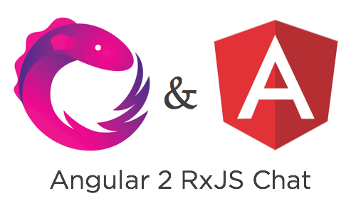
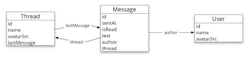
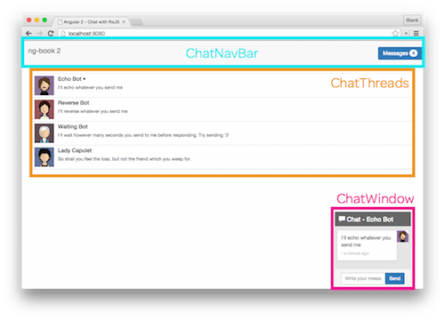

<p align="center">
  
</p>

# Angular 2 RxJS Chat [](https://gitter.im/ng-book/ng-book?utm_source=badge&utm_medium=badge&utm_campaign=pr-badge&utm_content=badge)

> An Angular 2 chat app using [Angular 2](https://angular.io/), [RxJS](https://github.com/Reactive-Extensions/RxJS), [Angular CLI](https://github.com/angular/angular-cli), [Webpack](https://webpack.github.io/), [TypeScript](http://www.typescriptlang.org/), Services, Injectables, [Karma](http://karma-runner.github.io/), Forms, and [tslint](http://palantir.github.io/tslint/) by the [ng-book 2 team](https://ng-book.com/2)

This repo shows an example chat application using RxJS and Angular 2. The goal is to show how to use the Observables data architecture pattern within Angular 2. It also features:

* Angular CLI, which configures Webpack with TypeScript, Karma, and tslint
* Writing async components that work with RxJS
* How to write injectable services in Angular 2
* And much more

<p align="center">
  
</p>

> Try the live [demo here](http://rxjs.ng-book.com)

## Quick start

```bash
# clone the repo
git clone https://github.com/ng-book/angular2-rxjs-chat.git

# change into the repo directory
cd angular2-rxjs-chat

# install
npm install

# run
npm start
```

Then visit [http://localhost:4200](http://localhost:4200) in your browser.

## Architecture

The app has three models:

* [`Message`](src/app/message/message.model.ts) - holds individual chat messages
* [`Thread`](src/app/thread/thread.model.ts) - holds metadata for a group of `Message`s
* [`User`](src/app/user/user.model.ts) - holds data about an individual user

<p align="center">
  
</p>

And there are three services, one for each model:

* [`MessagesService`](src/app/message/messages.service.ts) - manages streams of `Message`s
* [`ThreadsService`](src/app/thread/threads.service.ts) - manages streams of `Thread`s
* [`UserService`](src/app/user/users.service.ts) - manages a stream of the current `User`

There are also three top-level components:

* [`ChatNavBar`](src/app/chat-nav-bar/chat-nav-bar.component.ts) - for the top navigation bar and unread messages count
* [`ChatThreads`](src/app/chat-threads/chat-threads.component.ts) - for our clickable list of threads
* [`ChatWindow`](src/app/chat-window/chat-window.component.ts) - where we hold our current conversation

<p align="center">
  
</p>

## Services Manage Observables

Each service publishes data as RxJS streams. The service clients subscribe to these streams to be notified of changes.

The `MessagesService` is the backbone of the application. All new messages are added to the `newMessages` stream and, more or less, all streams are derived from listening to `newMessages`. Even the `Thread`s exposed by the `ThreadsService` are created by listening to the stream of `Message`s.

There are several other helpful streams that the services expose:

For example, the `MessagesService` exposes the `messages` stream which is a stream of _the list of the all current messages_. That is, `messages` emits an array for each record.

Similarly, the `ThreadsService` exposes a list of the chronologically-ordered threads in `orderedThreads` and so on.

Understanding how RxJS streams can be tricky, but this code is heavily commented. One strategy to grokking this code is to start at the components and see how they use the services. The other strategy is to get a copy of [ng-book 2](https://ng-book.com/2) where we explain each line in detail over ~60 pages.

## Bots

This app implements a few simple chat bots. For instance:

* Echo bot
* Reversing bot
* Waiting bot


<div style="clear:both"></div>

## Detailed Installation

**Step 1: Install Node.js from the [Node Website](http://nodejs.org/).**

We recommend Node version 4.1 or above. You can check your node version by running this:

```bash
$ node -v
vv4.1...
```

**Step 2: Install Dependencies**

```bash
npm install
```

## Running the App

```bash
npm run go
```

Then visit [http://localhost:4200](http://localhost:4200) in your browser.

## Running the Tests

You can run the unit tests with:

```bash
npm run test
```

## Future Plans

There are two big changes we plan to make to this repo:

### 1. Add HTTP Requests

Currently the bots are all client-side and there are no HTTP requests involved in the chats.

We will move the chat bots to a server and integrate API requests into this project once the Angular 2 HTTP client development has settled down.

### 2. `ON_PUSH` change detection

Because we're using observables, we can improve the performance of these components by using `ON_PUSH` change detection. Again, once Angular 2 development stabilizes, we'll be making this change.

## Contributing

There are lots of other little things that need cleaned up such as:

- More tests
- Cleaning up the vendor scripts / typings
- Simplifying the unread messages count

If you'd like to contribute, feel free to submit a pull request and we'll likely merge it in.

## Getting Help

If you're having trouble getting this project running, feel free to [open an issue](https://github.com/ng-book/angular2-rxjs-chat/issues), join us on [Gitter](https://gitter.im/ng-book/ng-book?utm_source=badge&utm_medium=badge&utm_campaign=pr-badge&utm_content=badge), or [email us](mailto:us@fullstack.io)!

___

# ng-book 2

<a href="https://ng-book.com/2">

</a>

This repo was written and is maintained by the [ng-book 2](https://ng-book.com/2) team. In the book we talk about each line of code in this app and explain why it's there and how it works.

This app is only one of several apps we have in the book. If you're looking to learn Angular 2, there's no faster way than by spending a few hours with ng-book 2.

<div style="clear:both"></div>

## License
 [MIT](/LICENSE.md)
